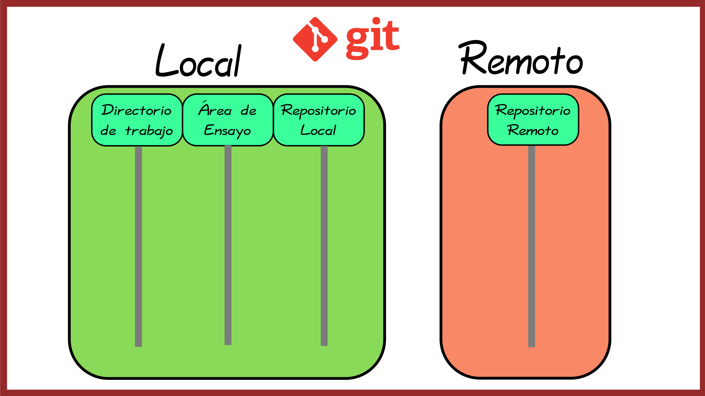

# Guía para el uso de GIT

## Antecedentes

> "Git es un sistema de control de versiones distribuido, gratuito y de código abierto, diseñado para manejar todo tipo de proyectos, desde pequeños a muy grandes, con rapidez y eficiencia."

Existen diversos proyectos privados con libre acceso que implementan GIT, tales como [gitlab](gitlab.com) y [github](github.com), este proyecto se encuentra en github, bajo el siguiente [enlace](https://github.com/accesibilidadenp1l4r3s).

A grandes rasgos GIT está conformado por dos grandes bloques:
* El bloque local (lo que está en tu equipo personal).
* El bloque público (lo que está en gitlab).

El bloque local consta de tres áreas:

* Directorio de trabajo (Working directory).
* área de ensayo (Staging area).
* Repositorio local.

La imagen muestra estos grandes bloques.

Se puede utilizar un repositorio de distintas formas por ahora solo mencionaremos dos:
* **Para tener acceso a la información que contiene:** La información va del repositorio publico al repositorio privado.
* **Para hacer aportaciones a un repositorio:** La información va del repositorio privado al repositorio público.
